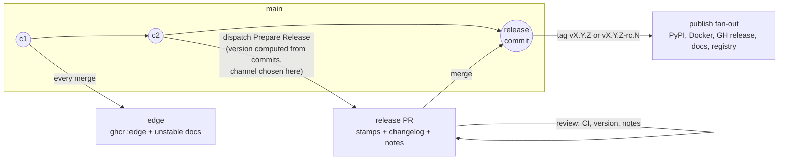

# Release system vision: the release is a pull request

- **Status:** proposal v2, 2026-08-18. Revised after maintainer review of v1: conventional-commit versioning is retained, tooling is adopted rather than built, and the stable release is a promotion of the last release candidate. Not yet adopted; no machinery changes in this document.
- **Relates to:** epic #1082 (supersedes its design iterations), epic #1054 (closed, superseded), #1055 (cut 4.0.0).
- **Scope:** the intended end-state flow only. How to migrate from the current PSR machinery — sequencing, issue breakdown, the fate of `v4.0.0-rc.1` — is deliberately out of scope and comes after this vision is agreed.

## 1. Why redesign, in one page

Two epics tried to fix releasing and both missed, in opposite directions.

**#1054** shipped a coherent model (trunk releases, `release/X.Y` stabilisation branches, `edge` channel, agent-written notes) on top of PSR — and PSR's identity flaw survived the overhaul: **the version is computed at publish time, after every review has already happened, outside any pull request**. The flaw is not conventional commits — it is *when and where* the computation lands. Everything the audits kept finding traces back to that one fact:

- An rc tag asserts a *prediction* of the stable it stabilises toward, and trunk motion keeps falsifying it — the `v3.2.0-rc.1…7` series ran five weeks and became mathematically unable to ever produce `3.2.0`. Nobody saw the computed version until the tag already existed.
- A stabilisation branch must be *named* `release/X.Y` before the tooling has ever computed `X.Y` — a wrong guess is detected at release time, when it is most expensive.
- Merge-back after every branch release is a hard requirement only because PSR's "already released" check is repo-global while its version computation is ancestry-scoped — a machinery-imposed deadlock, not a property of releasing.
- The release commit is pushed with an admin-bypass token and never passes through CI or review.
- Release notes can only be drafted *after* the stable ships (template#371) — the review happens when it can no longer change anything.

**#1082** correctly diagnosed that the flaw was upstream of implementation, then over-corrected: "owned, verifiable release transactions", per-destination convergence verification, resumable publication, a protected append-only ledger — 18 children, no architecture agreed, zero PRs landed. The lesson taken from it here: move the version computation and the narrative review into a pull request, adopt the tooling that already exists for exactly this, and stop. This use case is not special enough to deserve bespoke machinery.

## 2. Requirements and preferences

**Requirements** — the flow must provide:

1. **`edge` releases on `main`** — every merge builds and ships a rolling, versionless artifact. (Exists today; kept unchanged.)
2. **PR-style releasing** — a release is prepared as a pull request whose diff contains the version bump, the changelog section, and the AI-drafted release notes. Review of that PR *is* the release review; merging it *is* the act of releasing.
3. **Release candidates** — versioned `vX.Y.Z-rc.N` pre-releases with a clean promotion path to the stable.

**Preferences** — strong defaults that bend before the requirements do, and before they force bespoke machinery:

- **Conventional-commit-driven versioning.** The version is computed from commit history, as today. The correction over PSR is placement, not authorship: the computation lands in the reviewed diff, with a human override available for the exceptional case — override is the escape hatch, never the default.
- **Adopt maintained tooling; do not build.** Owned release machinery is a maintenance liability that two epics have now demonstrated. Where an existing tool covers the flow, the flow bends to the tool.
- **The stable release equals the last rc.** Promotion re-releases the candidate's exact source; it does not cut a fresh release. (Bit-for-bit identical *artifacts* are impossible where the version is baked into the artifact — a PyPI wheel's metadata carries it — so the promise is: same source tree, and a promotion diff that contains version/changelog stamps and nothing else.)
- **No new per-contributor process.** Feature PRs keep their current discipline (conventional title, linked issue). No changeset-file-per-PR or news-fragment obligations.

## 3. The model

> A release is a pull request. Preparing one computes the version from conventional commits, stamps it, and drafts the narrative; reviewing it is the release review; merging it publishes.

### The three channels, restated

| Channel | Identity | Promise |
|---|---|---|
| `edge` | none — the commit is the identity | newest merged code, rebuilt on every merge to `main`; rolling, disposable |
| rc | `vX.Y.Z-rc.N` — the target was **computed and reviewed in a merged PR** | an installable stabilisation step toward exactly that version |
| stable | `vX.Y.Z` | the promotion of the last rc's exact source, or a direct cut from quiescent trunk; rolling pointers follow it only when it is newest in its series |

The rc promise finally holds: the target is no longer an unreviewed prediction. If the computation lands on a version the maintainer disagrees with, that surfaces in the release PR's diff — before any tag exists — and is corrected there.

## 4. The flow

### 4.1 Prepare

A human dispatches **Prepare Release** on the branch to release from (`main` by default), choosing only the channel (`rc | stable`) and, exceptionally, a version override. Releasing stays a deliberate event — dispatch-driven, not push-driven — which is also what makes the release PR safe to hand-edit: nothing regenerates it unless someone re-dispatches. The workflow, on a release-prep branch:

1. **Computes the version** from conventional commits since the last release in that series (rc runs append `-rc.N`, auto-numbered). The `!`/`BREAKING CHANGE` markers drive the major bump, as today.
2. **Stamps** the version-coupled files: `pyproject.toml` and `uv.lock` always; `server.json` and the Claude-plugin manifests on stable only (rc versions never reach PyPI, so PyPI-pinning manifests keep the last stable — unchanged invariant).
3. **Renders the changelog section** into `CHANGELOG.md` from the same conventional commits — machine-written, never hand-maintained.
4. **Drafts the release notes**: the notes agent (existing `writing-release-notes` skill, unchanged evidence contract) writes or extends `docs/releases/X.Y.md`, including the release-body summary block.
5. **Opens the release PR** against the branch it was dispatched from.

The advisory quiescence check (release milestone, `ships-atomically` label) runs at prepare time — still advisory, never blocking. It moves to the moment it can actually inform: before the PR exists, not after the tag does.

### 4.2 Review

The release PR is an ordinary PR. Full CI runs on it — **the released commit has passed CI**, which the PSR-pushed release commit never did. The reviewer checks the computed version against the breaking-change policy (the review is the correction point the current system lacks: a mis-typed `!` no longer silently mis-versions a release), reviews the notes against the evidence contract, and edits notes freely in the diff.

### 4.3 Merge = release

Merging a release PR triggers the release step of the same tooling:

1. Tag the merged commit `vX.Y.Z[-rc.N]` and create the GitHub release with the **reviewed** summary block from the notes page as its body. The interim-body/marker handshake and the post-release notes-upgrade workflow disappear: the notes are already in the tag. Tag creation is the only remaining ruleset-bypass operation — replacing today's direct release-commit and merge-back pushes to `main`.
2. Fan out publishes exactly as today, with every gate derived from the tag's version string (prerelease-ness is `-rc.` in the tag — itself reviewed, so gate and intent cannot desync):
   - stable: PyPI (trusted publishing), Docker `vX.Y.Z` + ordering-gated `latest`/`vX`/`vX.Y`, linux packages, mcpb bundle, `mike deploy` + ordering-gated `latest` alias, marketplace and MCP-registry entries (ordering-gated);
   - rc: Docker `vX.Y.Z-rc.N`, GH pre-release + mcpb bundle only.

The docs deploy simplification is real: because notes merge *before* the tag exists, `mike` deploys the tag with its notes already in place — no post-merge overlay redeploy.

### 4.4 Release candidates and promotion

An rc is a release PR prepared with `channel: rc` — nothing more. Cut from quiescent trunk by default; from a `release/X.Y` branch when trunk is dirty (unchanged doctrine from design decision 23).

**Promotion honors "the stable is the last rc."** Dispatching Prepare with `channel: stable` for a series that has rcs promotes the last rc's source: the workflow verifies that no commits other than release-prep commits have landed since `vX.Y.Z-rc.N`, and refuses otherwise — new source means a new rc first, never a silently different stable. The stable release PR's diff against the candidate is therefore version/changelog stamps only, and the reviewer can *see* that the candidate is what ships. Notes were already drafted and reviewed during the rc cycle; promotion adds no new prose. No finalize flag, no one-run generated config override.

### 4.5 Stabilisation branches and backports

`release/X.Y` remains the exception tool for the same two cases (dirty trunk at cut time; patching a shipped release, with the branch created retroactively from the tag). Release PRs simply target the branch instead of `main`; the tag lands there.

The branch-naming chicken-and-egg is defused rather than dissolved: cut the branch, dispatch Prepare, and the computed version is visible in the release PR before any tag exists — a misnamed branch is a rename, not a burned tag. Where the target is known upfront (a backport patch to a shipped `X.Y`), it is anyway unambiguous.

**Mandatory merge-back is abolished.** With no repo-global version recomputation, a tag unreachable from `main` blocks nothing. What `main` still wants from a branch release is bookkeeping — the changelog section and the notes-page delta (notes pages are canonical on `main` only). The release step ports those as an ordinary follow-up PR to `main`: no admin bypass, no conflict-resolution script, and nothing deadlocks if it merges late.

### 4.6 `edge`

Unchanged, by design: push to `main` → `ghcr :edge` + `mcpb-bundle-edge` artifact + rolling `unstable` docs. No tag, no release, no version, no manifest churn. `edge` stays the sole rolling unstable tag; rcs ship only under immutable version tags.

## 5. Decisions

| # | Decision |
|---|---|
| D1 | A release is a pull request; merging it is the act of releasing. |
| D2 | The version is computed from conventional commits **inside the release PR**, where it is reviewed before any tag exists. A human override exists for the exceptional case; it is never the default. The version is never computed at publish time. |
| D3 | Channel (rc vs stable) is expressed in the version string inside the reviewed diff; every publish gate derives from the resulting tag, never from a dispatch-time flag. |
| D4 | The tag is created by automation *after* merge, on the merged commit. Direct pushes to protected branches are removed from the release path; the ruleset bypass shrinks to tag creation. |
| D5 | `edge` is untouched: versionless, rolling, one producer. |
| D6 | Release notes are drafted into the release PR and reviewed *before* publishing. The post-release notes pipeline (draft PR after the stable, body-upgrade workflow, docs overlay redeploy) is retired. This also resolves template#371 — rc notes get reviewed during stabilisation, not after the stable. |
| D7 | `CHANGELOG.md` stays machine-written from conventional commits by the release tool, rendered at prepare time so the section is part of the reviewed diff. |
| D8 | Conventional commits and the PR-title gate are retained at full weight: they feed both the changelog and the version computation, exactly as intended today — with the release PR as the review point PSR never had. |
| D9 | The breaking-change policy (operator surface / public library interface, assessed against last stable) is unchanged; `!` markers drive the computed major bump and the release-PR reviewer verifies the result against the policy. |
| D10 | The stable is the promotion of the last rc's exact source. The promotion path enforces a stamps-only diff against the candidate and refuses if other commits intervened — new source requires a new rc. |
| D11 | Stabilisation branches remain the exception tool. Mandatory merge-back is abolished; branch releases port changelog/notes to `main` via an ordinary automated PR. |
| D12 | rc release PRs never touch PyPI-pinning manifests (`server.json`, plugin manifests); those move on stable only. `uv.lock` moves on every release. |
| D13 | The flow is implemented by **adopting an existing release tool** — knope recommended, release-please the documented fallback (§6). Owned machinery is the last resort, kept to the glue no tool can own (the publish fan-out, which already exists). The flow itself is tool-agnostic: if the adopted tool disappoints, the adopter is swapped, not the model. |
| D14 | Per-destination convergence verification, publication ledgers, and resumable-transaction machinery are explicitly rejected as over-engineering. Workflow runs, the existing release-contract tests, and `get_server_info` are the observability surface. |

## 6. Tooling: adopt, don't build

The 2026 landscape was surveyed (release-please, knope, PSR, commitizen, changesets/towncrier/changie, custom flows) against the requirements and preferences in §2.

**Recommended: [knope](https://knope.tech).** It is the existing tool that covers the whole flow without bending it:

- **Conventional commits natively** — changeset files are optional in knope, not required; the no-new-contributor-process preference holds.
- **Dispatch-driven release-PR recipe** is a documented first-class workflow (`PrepareRelease` → PR → merge → `Release` tags and creates the GitHub release). Because preparation is dispatch-driven, nothing regenerates the PR branch — AI notes and hand edits are safe in the diff.
- **Real rc support**: `--prerelease-label rc` produces `X.Y.Z-rc.N` with correct continuation, and the next stable run finalizes cleanly — no config-override hack.
- **`--override-version`** covers the exceptional manual case.
- **File coverage**: `pyproject.toml` (PEP 621) natively; `server.json`/plugin manifests via regex `versioned_files` entries; `uv.lock` via a Command step (`uv lock --upgrade-package …`) — the current bump script's responsibilities map onto configuration plus at most a thin retained script, freed from PSR's tool-less container.

Its honest risk: pre-1.0, primarily one maintainer. Mitigations: the CLI is pinned like any other CI tool; the knope config is small and declarative; and per D13 the flow is tool-agnostic — the switching cost to the fallback is a config rewrite, not a redesign.

**Fallback: [release-please](https://github.com/googleapis/release-please).** The mainstream release-PR tool, and conventional-commit-driven like knope. It loses the recommendation on two behaviors that hit this flow directly: the rc→stable transition is a years-open unimplemented request (googleapis/release-please#2515), and its push-driven release PR regenerates on every trunk merge, overwriting hand edits (#2769 → #877) — which would force the AI notes out of the release PR into a separate reviewed PR, and reduce rcs to config gymnastics. Acceptable degradations if knope ever has to be replaced; not the first choice.

**Retired: PSR.** It has forced bumps and rc branches, but a release-PR mode is architecturally absent and was declined upstream (python-semantic-release#355). Its model — compute, commit, tag, push in one unreviewable shot — is precisely the shape being removed. Building the flow by hand (v1's recommendation) is likewise rejected per the adopt-don't-build preference: the glue this project keeps is the publish fan-out it already owns, nothing more.

## 7. What the redesign deletes

- PSR itself: config block, action, the deprecated `angular` parser concern (template#370), the stdlib-only bumper constraint (whatever stamping script survives runs on a normal runner with `uv` available).
- The merge-back machinery: `scripts/merge_back.sh`, its tests, the retry loop — the deadlock it guarded against no longer exists.
- The `finalize` generated-config override and the `force` input (replaced by the reviewed computation plus the explicit override).
- Admin-bypass direct pushes of release commits and merge-backs to `main`.
- Prediction-asserting rc tags, and the class of defects behind template#154 and #235.
- `release-notes.yml` + `release-notes-publish.yml` as post-release machinery, the interim-body marker handshake, and the docs overlay redeploy.

## 8. What survives unchanged

- The release *model* prose: trunk-first, value-triggered cadence, branch-as-exception, quiescence signals (advisory), "merging is not releasing" — only the mechanics under it change. A feature merge feeds `edge`; a release-PR merge releases.
- Conventional commits and the PR-title gate, at full weight (D8).
- Ordering-aware rolling pointers (Docker `latest`/`vX`/`vX.Y`, GH latest-release, docs `latest`, marketplace, registry) — a backport never repoints them backwards.
- The notes evidence contract, the one-page-per-minor format, `RELEASE-SUMMARY` markers, and the machine/narrative boundary between `CHANGELOG.md` and `docs/releases/`.
- The release-contract tests, rewritten to assert the same invariants against the new prepare step (rc leaves PyPI-pins untouched; stable bumps every published field; committed pins in lockstep at the last stable; promotion diff is stamps-only).
- Per-branch release concurrency; one tag, one producer; immutable tags.

## 9. Open questions (to settle at design review, not to grow)

1. **Knope verification spike**: confirm against a scratch repo that the researched behaviors hold end-to-end for this shape — rc continuation and finalization across a `release/X.Y` branch, regex `versioned_files` on the JSON manifests vs. keeping a thin stamp script as a Command step, and tag/release creation with the repo's rulesets. First implementation step, cheap, and the go/no-go for the fallback.
2. **Tag-creation credential**: `RELEASE_TOKEN` retained but used only for the tag push and follow-up PRs, or a GitHub App token with a tag-scoped ruleset bypass. Decide with the rulesets change.
3. **Staleness of an open release PR** while trunk moves: proposal is convention plus an advisory bot comment ("main has advanced N commits past this PR's base"), with re-dispatch as the refresh mechanism. Merging a stale release PR ships the merge commit — reviewer's call, as with any PR.
4. **First release under the new system** and the disposition of `v4.0.0-rc.1` / `release/4.0` — a migration question, parked until the vision is agreed.

Implementation is template-first (`fastmcp-server-template` owns `release.yml`, the bumper, and the contract tests; an mvm-first build would be clobbered by the next `copier update`), adopted here through a released template version. Sequencing that migration is the next document, not this one.
