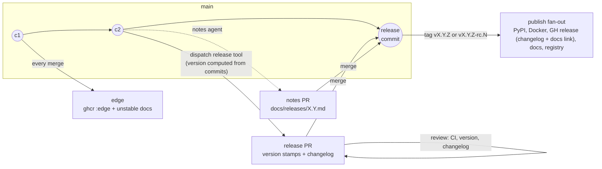

# Release system vision: the release is a pull request

- **Status:** proposal v4, 2026-08-18. v2 revised the vision per maintainer review (conventional commits retained, adopt-not-build, stable equals last rc); v3 folded in a hands-on comparison of knope and release-please and the notes-placement direction; v4 re-weighs that comparison per maintainer findings (rc.0 numbering is cosmetic; the manifest invariant is per-surface resolvability, not committed pins; changelog fidelity lives in the notes page) and recommends knope. Amended after the PR's critical review (promotion guard ordering pinned pre-tag, regeneration semantics scored consistently across both finalists, `uv.lock`'s stamp scope clarified) and after the two-stage spike — local, then a live scratch GitHub repository — verifying §9.1 end to end. Not yet adopted; no machinery changes in this document.
- **Relates to:** epic #1082 (supersedes its design iterations), epic #1054 (closed, superseded), #1055 (cut 4.0.0).
- **Scope:** the intended end-state flow only. How to migrate from the current PSR machinery — sequencing, issue breakdown, the fate of `v4.0.0-rc.1` — is deliberately out of scope and comes after this vision is agreed.

## 1. Why redesign, in one page

Two epics tried to fix releasing and both missed, in opposite directions.

**#1054** shipped a coherent model (trunk releases, `release/X.Y` stabilisation branches, `edge` channel, agent-written notes) on top of PSR — and PSR's identity flaw survived the overhaul: **the version is computed at publish time, after every review has already happened, outside any pull request**. The flaw is not conventional commits — it is *when and where* the computation lands. Everything the audits kept finding traces back to that one fact:

- An rc tag asserts a *prediction* of the stable it stabilises toward, and trunk motion keeps falsifying it — the `v3.2.0-rc.1…7` series ran five weeks and became mathematically unable to ever produce `3.2.0`. Nobody saw the computed version until the tag already existed.
- A stabilisation branch must be *named* `release/X.Y` before the tooling has ever computed `X.Y` — a wrong guess is detected at release time, when it is most expensive.
- Merge-back after every branch release is a hard requirement only because PSR's "already released" check is repo-global while its version computation is ancestry-scoped — a machinery-imposed deadlock, not a property of releasing.
- The release commit is pushed with an admin-bypass token and never passes through CI or review.
- Release notes can only be drafted *after* the stable ships (template#371) — the review happens when it can no longer change anything.

**#1082** correctly diagnosed that the flaw was upstream of implementation, then over-corrected: "owned, verifiable release transactions", per-destination convergence verification, resumable publication, a protected append-only ledger — 18 children, no architecture agreed, zero PRs landed. The lesson taken from it here: move the version computation into a pull request, adopt the tooling that already exists for exactly this, and stop. This use case is not special enough to deserve bespoke machinery.

## 2. Requirements and preferences

**Requirements** — the flow must provide:

1. **`edge` releases on `main`** — every merge builds and ships a rolling, versionless artifact. (Exists today; kept unchanged.)
2. **PR-style releasing** — a release is prepared as a pull request whose diff contains the version bump and the changelog section, reviewed before anything publishes. Merging it is the act of releasing.
3. **Release candidates** — versioned `vX.Y.Z-rc.N` pre-releases with a clean promotion path to the stable.

**Preferences** — strong defaults that bend before the requirements do, and before they force bespoke machinery:

- **Conventional-commit-driven versioning.** The version is computed from commit history, as today. The correction over PSR is placement, not authorship: the computation lands in the reviewed diff, with an explicit override for the exceptional case — override is the escape hatch, never the default.
- **Adopt maintained tooling; do not build.** Owned release machinery is a maintenance liability that two epics have now demonstrated. Where an existing tool covers the flow, the flow bends to the tool.
- **The stable release equals the last rc — same source, asserted.** Promotion re-releases the candidate's exact source tree: the stable's diff against the last rc contains version/changelog stamps and nothing else, and the promotion path verifies this mechanically. (Bit-for-bit identical *artifacts* are out of reach where the version is baked in — a PyPI wheel's metadata carries it — so same-source-asserted is the deliberate strictness level.)
- **Per-surface resolvability, not committed pins.** The requirement on the install-channel manifests (`server.json`, plugin manifests, mcpb) is that **every install surface resolves, at install time, to a version that actually exists on that surface**. rc versions never reach PyPI, the MCP registry, or the marketplace, so surfaces pinned to those move on stable only. *How* — committed stable-only stamps via a small stamp step, or publish-time rendering from a version-neutral template as the mcpb channel already does — is an implementation choice made per surface, not a property of the release tool.
- **The narrative lives in `docs/releases/`, not in the release PR — and it is the fidelity layer.** The AI-written notes are reviewed in their own PR against the docs page, exactly as the notes contract works today: issue/PR links, revert narration, and causal explanation belong there. The GitHub release body is the machine changelog plus a pointer to the versioned docs page. `CHANGELOG.md` is the plain machine audit trail and is held to no higher standard.
- **No new per-contributor process.** Feature PRs keep their current discipline (conventional title, linked issue). No changeset-file-per-PR or news-fragment obligations.

## 3. The model

> A release is a pull request. The release tool computes the version from conventional commits and prepares a release PR carrying the bump and changelog; the narrative is reviewed in a sibling docs PR; merging the release PR is the decision, and the release step tags and publishes.

### The three channels, restated

| Channel | Identity | Promise |
|---|---|---|
| `edge` | none — the commit is the identity | newest merged code, rebuilt on every merge to `main`; rolling, disposable |
| rc | `vX.Y.Z-rc.N` — the target was **computed and reviewed in a merged PR** | an installable stabilisation step toward exactly that version |
| stable | `vX.Y.Z` | the promotion of the last rc's exact source, or a direct cut from quiescent trunk; rolling pointers follow it only when it is newest in its series |

The rc promise finally holds: the target is no longer an unreviewed prediction. If the computation lands on a version the maintainer disagrees with, that surfaces in the release PR's diff — before any tag exists — and is corrected there.

## 4. The flow

### 4.1 Prepare

A human dispatches the release tool on the branch to release from (`main` by default). Releasing stays a deliberate event — dispatch-driven, not push-driven, so the release PR appears when a release is wanted, not on every merge. The dispatch chooses the channel: rc is the default on `release/*` branches, and the promotion run selects stable explicitly. (Deriving the channel *purely* from the branch was live-tested and is a trap: it makes the plain promotion run unreachable on the very branch that needs it — §9.1. The safety D3 actually requires is preserved either way: the chosen channel lands in the version string inside the reviewed diff, so a wrong choice is visible in the PR before any tag exists.) The tool then:

1. **Computes the version** from conventional commits since the last release in that branch's series (`!`/`BREAKING CHANGE` → major, `feat` → minor, `fix` → patch). On a stabilisation branch this yields `X.Y.Z-rc.N` instead (§4.4). An explicit version override exists for the exceptional case.
2. **Stamps the version-coupled files** in the release PR's diff: `pyproject.toml`, `CHANGELOG.md`, and `uv.lock`'s self-version natively; the install-channel manifests through a small stamp step invoked with the computed version, applying the per-surface resolvability rule (§2) — stable stamps them, rc leaves them.
3. **Renders the changelog section** from the same conventional commits — machine-written, never hand-maintained.
4. **Opens or refreshes the release PR** against the branch it was dispatched from.

In parallel, the **notes agent** drafts or extends `docs/releases/X.Y.md` (existing `writing-release-notes` skill) as a sibling PR to `main` — now draftable as soon as a release PR exists, rc phase included, which resolves template#371's "notes can only be reviewed after the stable ships". One adaptation is required to make that true: today's skill and workflow hard-require an existing stable tag and research the range `PREV…TAG`, so the research range generalizes to *last stable of the series … the release PR's source commit* — the evidence rules themselves are unchanged, only the range endpoints move — and the notes PR is refreshed alongside any re-dispatch of the release PR. The advisory quiescence check (release milestone, `ships-atomically` label) runs at prepare time — still advisory, never blocking.

### 4.2 Review

The release PR is an ordinary PR. Full CI runs on it — **the released commit has passed CI**, which the PSR-pushed release commit never did. The reviewer checks the computed version against the breaking-change policy (the review is the correction point the current system lacks: a mis-typed `!` no longer silently mis-versions a release) and the changelog section. The notes PR is reviewed on its own clock against the evidence contract; it does not gate the release (unchanged from today's contract), and hand edits are safe there because the release tool never touches it.

If trunk moves while a release PR is open, its content is refreshed by re-dispatching. Refreshing recreates the preparation branch from the base and force-pushes it, updating the same PR in place (verified in the local spike, §9.1a) — and that is safe *by construction*: the release PR carries no hand-written prose (D6), so there is never review work on the branch to destroy. One operational rule is load-bearing: the prepare workflow must **always recreate the prep branch from base, never re-run preparation on the stale branch** — re-running on already-stamped files does not refuse, it computes the *next* version on top of the stamped one (double-bump, observed in the spike). Merging a stale release PR would ship commits the changelog does not describe, so an advisory staleness check comments when the base has advanced.

### 4.3 Merge = release

Merging the release PR is the decision; the tool's release step (triggered by the merge) tags the release commit `vX.Y.Z[-rc.N]` and creates the GitHub release. For a promotion, the same-source guard (§4.4) runs **before** the tag is created. One verified GitHub behavior constrains the wiring: tags and releases created with the workflow's own `GITHUB_TOKEN` trigger **no** downstream workflows (confirmed 0-for-10 in the live spike, §9.1) — so either the release step runs with an App/PAT token (today's `RELEASE_TOKEN` pattern, now scoped to this single step per D4) so `release: published` consumers keep firing, or the publish fan-out chains directly off the tag-creating workflow run instead of listening for events. The choice is an implementation decision (§9.2). The body is the machine changelog section plus — **once the notes page for the release actually exists** — a pointer to it. The pointer stays conditional exactly as today, so a release published before the notes PR merges carries an interim body rather than a dead link; the surviving notes-publish mechanism (§7) adds the deep link and redeploys the page when the notes merge. Notes never gate the release, unchanged from today's contract. Tag creation is the only remaining ruleset-sensitive operation, replacing today's direct release-commit and merge-back pushes to `main`.

The publish fan-out is unchanged, with every gate derived from the tag's version string (prerelease-ness is `-rc.` in the tag — itself reviewed, so gate and intent cannot desync):

- stable: PyPI (trusted publishing), Docker `vX.Y.Z` + ordering-gated `latest`/`vX`/`vX.Y`, linux packages, mcpb bundle, `mike deploy` + ordering-gated `latest` alias, marketplace and MCP-registry entries (ordering-gated);
- rc: Docker `vX.Y.Z-rc.N`, GH pre-release + mcpb bundle only.

### 4.4 Release candidates and promotion

An rc is a release PR prepared with the rc channel — derived from dispatching on a `release/X.Y` branch. Cut rcs when genuinely stabilising; quiescent-trunk stables need no rc and no branch (unchanged doctrine from design decision 23). The tool numbers the series from `rc.0` — accepted as cosmetic; PEP 440 normalizes either way.

**Promotion honors "the stable is the last rc," same-source-asserted — and it is the tool's plain path.** Dispatching the same prepare workflow on the branch *without* the rc channel computes exactly `X.Y.Z` from the same commits (verified hands-on: after `-rc.0` and `-rc.1`, a plain run yields `X.Y.Z`, not the next minor). No finalize flag, no footer-commit ceremony, no one-run generated config override. A same-source guard verifies that nothing but release stamps changed since `vX.Y.Z-rc.N` — **gating the promotion PR at prepare time**, and again **hard, before the tag is created**, in the release step. Ordering matters twice over (both verified in the local spike, §9.1b): tags are immutable, so a refusal must leave no tag behind — refusing after tagging would recreate exactly the burned-tag failure class §1 indicts; and a refusal *after* a promotion prep has merged leaves stamped-but-untagged files from which the tool computes the *next* version, skipping the target number unless the prep commit is reverted. The prepare-time gate exists to make that recovery path rare: a promotion that would fail the guard should never reach a mergeable PR. On refusal the remedy is a new rc (reverting the refused prep first), never a silently different stable. Notes were already drafted and reviewed during the rc cycle; promotion adds no new prose.

### 4.5 Stabilisation branches and backports

`release/X.Y` remains the exception tool for the same two cases (dirty trunk at cut time; patching a shipped release, with the branch created retroactively from the tag). Release PRs simply target the branch; the tag lands there. The branch-naming chicken-and-egg is defused: the computed version is visible in the release PR before any tag exists, so a misnamed branch is a rename, not a burned tag.

**Merge-back as deadlock prevention is abolished** — the version computation is ancestry-local, so a branch tag cannot wedge `main`. What `main` still wants from a branch release is bookkeeping: the changelog section and the notes-page delta (notes pages are canonical on `main` only). Those port to `main` as an ordinary automated PR — no admin bypass, no conflict-resolution script, and nothing deadlocks if it merges late. Late is not never: the same advisory nag that watches release-PR staleness (§4.2) covers an unmerged port PR, so `main`'s changelog and notes cannot drift silently after a backport.

### 4.6 `edge`

Unchanged, by design: push to `main` → `ghcr :edge` + `mcpb-bundle-edge` artifact + rolling `unstable` docs. No tag, no release, no version, no manifest churn. `edge` stays the sole rolling unstable tag; rcs ship only under immutable version tags.

## 5. Decisions

| # | Decision |
|---|---|
| D1 | A release is a pull request; merging it is the act of releasing. |
| D2 | The version is computed from conventional commits **inside the release PR**, where it is reviewed before any tag exists. An explicit override exists for the exceptional case; it is never the default. The version is never computed at publish time. |
| D3 | Channel (rc vs stable) is chosen at prepare time — rc by default on `release/*`, stable selected explicitly for promotion — and expressed in the version string inside the reviewed diff, where it is reviewed before any tag exists. Every publish gate derives from the resulting tag, never from the dispatch-time choice. (Pure branch-derivation was live-tested and rejected: it makes promotion unreachable — §4.1, §9.1.) |
| D4 | The tag is created by the tool *after* merge, on the merged release commit. Direct pushes to protected branches are removed from the release path. |
| D5 | `edge` is untouched: versionless, rolling, one producer. |
| D6 | The AI narrative lives in `docs/releases/`, reviewed in its own PR (existing notes contract), draftable from the moment a release PR exists — rc phase included (resolves template#371). It is the **fidelity layer**: issue/PR links, revert narration, causal explanation. The GitHub release body is the machine changelog plus a pointer to the versioned docs page. The release PR carries no hand-written prose. |
| D7 | `CHANGELOG.md` stays machine-written from conventional commits by the release tool, rendered into the release PR diff. It is a plain audit trail; entry richness (links, reverts) is the notes page's job, not the changelog's. |
| D8 | Conventional commits and the PR-title gate are retained at full weight: they feed both the changelog and the version computation, with the release PR as the review point PSR never had. |
| D9 | The breaking-change policy (operator surface / public library interface, assessed against last stable) is unchanged; `!` markers drive the computed major bump and the release-PR reviewer verifies the result against the policy. |
| D10 | The stable is the promotion of the last rc's exact source — **same source, asserted**: promotion is the tool's plain (non-rc) run over the same commits, and a guard verifies a stamps-only diff against the candidate **before the tag is created** (gating the promotion PR at prepare, hard pre-tag at release), refusing if other commits intervened; a refusal leaves no tag behind, and new source requires a new rc — with the refused promotion prep reverted first, or the version number is skipped (§4.4). |
| D11 | Stabilisation branches remain the exception tool. Merge-back as deadlock prevention is abolished; branch releases port changelog/notes bookkeeping to `main` via an ordinary automated PR. |
| D12 | **Per-surface resolvability**: every install surface must resolve, at install time, to a version that exists on that surface. rc versions reach none of PyPI/registry/marketplace, so the manifests pinned to those move on stable only — via a small stamp step or per-surface publish-time rendering (as the mcpb channel already does); the choice is made per surface at implementation time. `uv.lock` tracks `pyproject.toml` and moves on every release — **by its self-version entry only**, a textual stamp exactly as today; full dependency re-resolution is never part of release preparation, so the lockfile change stays inside D10's stamps-only promotion diff (verified across a full rc→stable cycle, §9.1c). One rc-only form note: the tool stamps SemVer form (`4.0.0-rc.2`) where `uv lock` canonicalizes to PEP 440 (`4.0.0rc2`); uv accepts the SemVer form (`uv lock --check` passes), but a later genuine re-resolution rewrites that one line — cosmetic, rc-hygiene only; stable versions are form-identical. |
| D13 | The flow is implemented by adopting **knope**, with release-please as the evaluated fallback (§6). Owned machinery shrinks to the publish fan-out (which exists), a small manifest stamp step, and thin guards. The flow is tool-agnostic: if the adopted tool disappoints, the adopter is swapped, not the model. |
| D14 | Per-destination convergence verification, publication ledgers, and resumable-transaction machinery are explicitly rejected as over-engineering. Workflow runs, the release-contract tests, and `get_server_info` are the observability surface. |

## 6. Tooling: adopt, don't build

Both finalists were evaluated hands-on against this repo's real files (2026-08-18): knope 0.23.0 exercised end-to-end in a scratch repo; release-please 17.11.1 verified by driving the library's own strategy and updater classes. v3 of this document read the evidence as favoring release-please; the maintainer's review re-weighed the three findings that carried that verdict, and each dissolves:

- *knope starts rc series at rc.0* — cosmetic; at most a one-time interaction with the existing `v4.0.0-rc.1` tag, which can be yanked if needed (a migration detail, §9).
- *knope's `versioned_files` cannot express stable-only manifest stamping* — a non-finding once the requirement is stated at the right altitude (D12): the invariant is per-surface resolvability, and a small stamp step invoked with the computed version (knope Command step) or publish-time rendering satisfies it per surface. This restatement is a modeling correction, not a bar moved to fit a preference: the mcpb channel has satisfied the same invariant all along with a version-neutral `${VERSION}` template rendered at build time, proving the committed pin was always one *means* among several, never the requirement itself. The stamp step is a slimmed, testable descendant of `scripts/bump_manifests.py`, freed from PSR's tool-less container.
- *knope's changelog loses links and reverts* — by design acceptable: `docs/releases/` is the fidelity layer (D6/D7); the changelog is a plain audit trail.

**Recommended: [knope](https://knope.tech).** With those costs dissolved, its verified strengths decide:

- **Identical bump rules and `v*` tags**, computed from squash subjects — this repo's PR-title regime, unchanged (verified: `fix`→patch, `feat`→minor, `!`→major).
- **The cleanest rc→promotion path of any tool evaluated**: `--prerelease-label rc` yields the series; a plain run afterwards yields exactly `X.Y.Z` from the same commits — promotion is the *absence of a flag*, with no finalize footer commit, no config flip, no per-branch config split (verified hands-on).
- **The release-PR recipe is knope's flagship workflow** (`PrepareRelease` → PR; merge → `Release` tags and creates the GitHub release), with `--override-version`, high-quality `--dry-run` plans usable as PR bodies, and local tagging that needs no token.
- **Regeneration on human terms**: preparation runs only when dispatched. Re-dispatch rewrites the prep branch under *both* finalists — the difference is when, not whether: knope regenerates only when a human asks, while release-please's default mode regenerates on every trunk push. Either way, branch rewriting is safe by construction because the release PR carries no hand-written prose (D6). The mechanics are verified (§9.1a): recreate-from-base + force-push to the stable branch name, updating the same PR — with the operational rule that preparation always starts from a fresh base checkout, never a stale prep branch (§4.2).
- One-time migration items, known and small: normalize `CHANGELOG.md` headings (`## vX.Y.Z` → `## X.Y.Z`; the `<!-- version list -->` flag line survives and insertion lands correctly after normalization), and configure `extra_changelog_sections` to keep today's section titles.

Its honest risk is posture, not function: pre-1.0, primarily one maintainer, schema still evolving (`--upgrade` migrates deprecated syntax). Mitigations: the CLI is pinned like any other CI tool and the config is small and declarative. Per D13 a swap to the fallback preserves the model — release PR, review, merge = release, same-source-asserted — but is honestly more than tool-side YAML: §4.4's promotion mechanics change shape (release-please finalizes via a `Release-As` footer commit instead of a plain run), and the dispatch workflow's inputs change with them.

**Fallback: [release-please](https://github.com/googleapis/release-please)** (the action, dispatch-only). Mainstream and verified workable: all five manifest stamps — including the oci `:vX.Y.Z` substring, the `.mcp.json` `==` pin, and `uv.lock`'s self-version — are expressible as built-in `extra-files` updaters (verified byte-level), and the rc→stable bug (googleapis/release-please#2515) is routed around via per-branch configs plus a one-commit `Release-As: X.Y.Z` finalize. It sits second on ceremony and shape: the two-phase dispatch, the finalize footer commit, push-triggered regeneration in its default mode (mitigable by running it dispatch-only, as the evaluation assumed), the finalize-on-branch config wrinkle, an action that lags the library, and an upstream responsive to Google's needs rather than the community's. All workable — which is exactly what a fallback must be.

**Retired: PSR.** A release-PR mode is architecturally absent and was declined upstream (python-semantic-release#355); its model — compute, commit, tag, push in one unreviewable shot — is precisely the shape being removed. Building the flow by hand (v1's recommendation) is likewise rejected per the adopt-don't-build preference.

## 7. What the redesign deletes

- PSR itself: config block, action, the deprecated `angular` parser concern (template#370).
- `scripts/bump_manifests.py` in its current form — replaced by native `versioned_files` for `pyproject.toml`/`uv.lock` plus a slimmed per-surface stamp step, running on a normal runner with real tooling available.
- The merge-back machinery: `scripts/merge_back.sh`, its tests, the retry loop — the deadlock it guarded against no longer exists.
- The `finalize` generated-config override and the `force` input (replaced by the plain promotion run and the explicit override).
- Admin-bypass direct pushes of release commits and merge-backs to `main`.
- Prediction-asserting rc tags, and the class of defects behind template#154 and #235.
- The post-release-only limitation of the notes pipeline: notes become draftable at rc time. The notes pipeline itself — agent PR against `docs/releases/`, merge-is-publish body/docs refresh — survives in simplified form (D6).

## 8. What survives unchanged

- The release *model* prose: trunk-first, value-triggered cadence, branch-as-exception, quiescence signals (advisory), "merging is not releasing" — only the mechanics under it change. A feature merge feeds `edge`; a release-PR merge releases.
- Conventional commits and the PR-title gate, at full weight (D8).
- Ordering-aware rolling pointers (Docker `latest`/`vX`/`vX.Y`, GH latest-release, docs `latest`, marketplace, registry) — a backport never repoints them backwards.
- The notes evidence contract, the one-page-per-minor format, `RELEASE-SUMMARY` markers, and the machine/narrative boundary between `CHANGELOG.md` and `docs/releases/`.
- The release-contract tests, rewritten to assert the same invariants against the new prepare step: rc leaves PyPI-pins untouched; stable satisfies per-surface resolvability on every published field; promotion diff is stamps-only; the changelog insertion flag survives.
- Per-branch release concurrency; one tag, one producer; immutable tags.

## 9. Open questions (to settle at design review, not to grow)

1. **End-to-end spike — executed 2026-08-18, in two stages; the model is verified.** *Locally* (knope 0.23.0, scratch repo mirroring the real manifests): the three critical-review criteria — re-dispatch refresh semantics with the never-rerun-on-a-stale-branch rule (§4.2), the pre-tag guard with a refusal leaving no tag, and `uv.lock` stamp isolation (D12) — all verified. *Live* (scratch GitHub repository `knope-release-spike`, real workflows, 8 release PRs, 6 tags, 5 releases): re-dispatch updated the **same PR in place** with no double-bump; **5 of 5** merged release PRs triggered the tag workflow (a closed-unmerged PR correctly triggered nothing); the rc cycle ran `0.3.0-rc.0 → rc.1 → 0.3.0` with promotion computing exactly the target and the guard logging a stamps-only pass; the violation drill's merged promotion was **refused by the guard with no tag and no release created**; rc stamps left the PyPI-pinning manifests untouched and knope auto-marked rc releases as prereleases. The channel-derivation trap (§4.1/D3) and the `GITHUB_TOKEN` trigger-suppression fact (§4.3) were both discovered here. One prerequisite documented for implementation: the repository setting "Allow GitHub Actions to create and approve pull requests" is required if the PR-creation step runs on `GITHUB_TOKEN` — creation 403s without it (observed 8×) and was **verified working once the setting is truly enabled** (knope created the templated release PR under `github-actions[bot]`); updating an existing PR works regardless of the setting. Running PR creation under the same App/PAT token as §9.2 avoids the setting entirely and is likely the right choice for the real repository. With this, every §9.1 item is verified; nothing in the spike remains open.
2. **Publish-fan-out wiring** (from the verified suppression fact in §4.3): run the tagging step with an App/PAT token so `release: published` and tag-push consumers keep firing (the `RELEASE_TOKEN` pattern, scoped per D4 to this single step), or chain the fan-out off the tag-creating workflow run and drop event-triggered publishing. Decide with the rulesets change — the token must also satisfy the `v*` tag ruleset.
3. **Per-surface stamping choices** (D12): which manifests keep committed stable-only stamps versus moving to publish-time rendering like the mcpb channel. Constraint to respect: the plugin channel serves committed files at a ref, so it likely keeps committed stamps.
4. **First release under the new system** and the disposition of `v4.0.0-rc.1` / `release/4.0`. The spike narrowed this: knope continues a series from the highest *reachable* rc tag of the target version — so preparing 4.0 on `release/4.0` (which contains the PSR-tagged commit) continues correctly at `rc.2` and promotes to `4.0.0` with no yank needed; only a trunk-prepared 4.0 series, where that tag is unreachable, would restart at `rc.0` below the existing `rc.1` and make yanking necessary. A migration choice, parked until the vision is agreed.

Implementation is template-first (`fastmcp-server-template` owns `release.yml`, the release-contract tests, and this configuration; an mvm-first build would be clobbered by the next `copier update`), adopted here through a released template version. Sequencing that migration is the next document, not this one.
