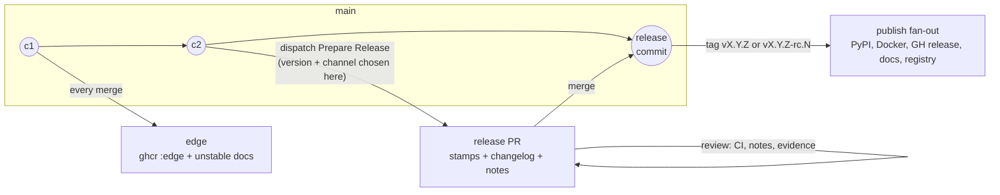

# Release system vision: the release is a pull request

- **Status:** proposal, 2026-08-18. Not yet adopted; no machinery changes in this document.
- **Relates to:** epic #1082 (supersedes its design iterations), epic #1054 (closed, superseded), #1055 (cut 4.0.0).
- **Scope:** the intended end-state flow only. How to migrate from the current PSR machinery — sequencing, issue breakdown, the fate of `v4.0.0-rc.1` — is deliberately out of scope and comes after this vision is agreed.

## 1. Why redesign, in one page

Two epics tried to fix releasing and both missed, in opposite directions.

**#1054** shipped a coherent model (trunk releases, `release/X.Y` stabilisation branches, `edge` channel, agent-written notes) on top of PSR — and PSR's identity flaw survived the overhaul: **the version is computed from commit history at publish time**. Everything the audits kept finding traces back to that one fact:

- An rc tag asserts a *prediction* of the stable it stabilises toward, and trunk motion keeps falsifying it — the `v3.2.0-rc.1…7` series ran five weeks and became mathematically unable to ever produce `3.2.0`.
- A stabilisation branch must be *named* `release/X.Y` before PSR has ever computed `X.Y` — the wrong guess is detected at release time, when it is most expensive.
- Merge-back after every branch release is a hard requirement only because PSR's "already released" check is repo-global while its version computation is ancestry-scoped — a machinery-imposed deadlock, not a property of releasing.
- The release commit is pushed with an admin-bypass token and never passes through CI or review.
- Release notes can only be drafted *after* the stable ships (template#371) — the review happens when it can no longer change anything.

**#1082** correctly diagnosed that the flaw was upstream of implementation, then over-corrected: "owned, verifiable release transactions", per-destination convergence verification, resumable publication, a protected append-only ledger — 18 children, no architecture agreed, zero PRs landed. The lesson taken from it here: fix the identity flaw (where the version is decided, and when the narrative is reviewed) and stop. Releasing a low-traffic project does not need distributed-systems machinery; it needs one reviewable decision point.

## 2. Requirements

1. **`edge` releases on `main`** — every merge builds and ships a rolling, versionless artifact. (Exists today; kept unchanged.)
2. **PR-style releasing** — a release is prepared as a pull request whose diff contains the version bumps, the changelog section, and the AI-drafted release notes. Review of that PR *is* the release review; merging it *is* the act of releasing.
3. **Release candidates** — versioned `vX.Y.Z-rc.N` pre-releases with a clean promotion path to the stable.

Consequences accepted up front: python-semantic-release is removed, and with it version-computation-from-commits. The version becomes an explicit human decision made at preparation time.

## 3. The model

> A release is a pull request. Preparing one stamps a chosen version and drafts the narrative; reviewing it is the release review; merging it publishes.

### The three channels, restated

| Channel | Identity | Promise |
|---|---|---|
| `edge` | none — the commit is the identity | newest merged code, rebuilt on every merge to `main`; rolling, disposable |
| rc | `vX.Y.Z-rc.N` — the target `X.Y.Z` was **chosen by a human and reviewed in a PR** | an installable stabilisation step toward exactly that version |
| stable | `vX.Y.Z` | the promotion of a reviewed release PR; rolling pointers follow it only when it is newest in its series |

The rc promise finally holds: the target can no longer be falsified by trunk motion, because it was never a prediction — it was a decision, recorded in a merged PR.

## 4. The flow

### 4.1 Prepare

A human dispatches **Prepare Release** on the branch to release from (`main` by default), with:

- `bump`: `major | minor | patch` — applied against the last stable in that branch's series — or an explicit `version` override;
- `channel`: `rc | stable`. For `rc`, the `-rc.N` suffix is auto-numbered from existing tags for the chosen `X.Y.Z`.

The workflow then, on a `release-prep/vX.Y.Z[-rc.N]` branch:

1. **Validates** the version: monotonic within its series, tag not taken, rc numbering consistent.
2. **Stamps** the version-coupled files: `pyproject.toml` and `uv.lock` always; `server.json` and the Claude-plugin manifests on stable only (rc versions never reach PyPI, so PyPI-pinning manifests keep the last stable — unchanged invariant).
3. **Renders the changelog section** into `CHANGELOG.md` — machine-written from conventional commits (git-cliff or equivalent), never hand-maintained.
4. **Drafts the release notes**: the notes agent (existing `writing-release-notes` skill, unchanged evidence contract) writes or extends `docs/releases/X.Y.md`, including the release-body summary block.
5. **Opens the release PR** against the branch it was dispatched from.

The advisory quiescence check (release milestone, `ships-atomically` label) runs at prepare time — still advisory, never blocking. It moves to the moment it can actually inform: before the PR exists, not after the tag does.

### 4.2 Review

The release PR is an ordinary PR. Full CI runs on it — **the released commit has passed CI**, which the PSR-pushed release commit never did. The reviewer checks the version choice (the breaking-change policy still governs it — the `!`/`BREAKING CHANGE` markers become evidence for the human's bump decision rather than machine-parsed triggers), reviews the notes against the evidence contract, and edits freely: nothing regenerates or clobbers the branch unless someone explicitly re-dispatches Prepare. This is the property that ruled out release-please, where any trunk push regenerates the PR and overwrites hand edits.

### 4.3 Merge = release

Merging a release PR (identified by branch prefix + label) triggers the **Tag & Publish** workflow:

1. Tag the merge commit `vX.Y.Z[-rc.N]`. This is the only remaining ruleset-bypass operation — scoped to creating one protected tag, replacing today's direct release-commit and merge-back pushes to `main`.
2. Create the GitHub release with the **reviewed** summary block from the notes page as its body. The interim-body/marker handshake and the post-release notes-upgrade workflow disappear: the notes are already in the tag.
3. Fan out publishes exactly as today, with every gate derived from the tag's version string (prerelease-ness is `-rc.` in the tag — which was itself reviewed, so gate and intent cannot desync):
   - stable: PyPI (trusted publishing), Docker `vX.Y.Z` + ordering-gated `latest`/`vX`/`vX.Y`, linux packages, mcpb bundle, `mike deploy` + ordering-gated `latest` alias, marketplace and MCP-registry entries (ordering-gated);
   - rc: Docker `vX.Y.Z-rc.N`, GH pre-release + mcpb bundle only.

The docs deploy simplification is real: because notes merge *before* the tag exists, `mike` deploys the tag with its notes already in place — no post-merge overlay redeploy.

### 4.4 Release candidates and promotion

An rc is a release PR carrying an rc version — nothing more. Cut from quiescent trunk by default; from a `release/X.Y` branch when trunk is dirty (unchanged doctrine from design decision 23 — but the branch-naming chicken-and-egg is gone, because the version is decided *before* anything is named after it).

Promotion: dispatch Prepare with `channel: stable` for the same `X.Y.Z`, from the same source. The stable release PR's diff against the rc is stamps + notes only when the source hasn't moved — the reviewer can *see* that the candidate is what ships. No finalize flag, no one-run generated config override.

### 4.5 Stabilisation branches and backports

`release/X.Y` remains the exception tool for the same two cases (dirty trunk at cut time; patching a shipped release, with the branch created retroactively from the tag). Release PRs simply target the branch instead of `main`; the tag lands there.

**Mandatory merge-back is abolished.** With no version computation from history, a tag unreachable from `main` blocks nothing. What `main` still wants from a branch release is bookkeeping — the changelog section and the notes-page delta (notes pages are canonical on `main` only). The Tag & Publish workflow ports those as an ordinary follow-up PR to `main`: no admin bypass, no conflict-resolution script, and nothing deadlocks if it merges late.

### 4.6 `edge`

Unchanged, by design: push to `main` → `ghcr :edge` + `mcpb-bundle-edge` artifact + rolling `unstable` docs. No tag, no release, no version, no manifest churn. `edge` stays the sole rolling unstable tag; rcs ship only under immutable version tags.

## 5. Decisions

| # | Decision |
|---|---|
| D1 | A release is a pull request; merging it is the act of releasing. |
| D2 | The version is an explicit human decision at prepare time (bump level or literal version), never computed from commit history. |
| D3 | Channel (rc vs stable) is expressed in the version string inside the reviewed diff; every publish gate derives from the resulting tag, never from a dispatch-time flag. |
| D4 | The tag is created by automation *after* merge, on the merged commit. Direct pushes to protected branches are removed from the release path; the ruleset bypass shrinks to tag creation. |
| D5 | `edge` is untouched: versionless, rolling, one producer. |
| D6 | Release notes are drafted into the release PR and reviewed *before* publishing. The post-release notes pipeline (draft PR after the stable, body-upgrade workflow, docs overlay redeploy) is retired. This also resolves template#371 — rc notes get reviewed during stabilisation, not after the stable. |
| D7 | `CHANGELOG.md` stays machine-written (git-cliff or equivalent from conventional commits), rendered at prepare time so the section is part of the reviewed diff. |
| D8 | Conventional commits and the PR-title gate are retained — for changelog quality and history hygiene — but carry no version semantics. A mistyped title can cost a changelog line, never mis-version a release. |
| D9 | The breaking-change policy (operator surface / public library interface, assessed against last stable) is unchanged; it now instructs the human's bump choice instead of a commit parser. |
| D10 | Stabilisation branches remain the exception tool; they are named after an already-decided version. |
| D11 | Mandatory merge-back is abolished; branch releases port changelog/notes to `main` via an ordinary automated PR. |
| D12 | rc release PRs never touch PyPI-pinning manifests (`server.json`, plugin manifests); those move on stable only. `uv.lock` moves on every release. |
| D13 | Implementation is plain GitHub workflows plus owned scripts (see §6) — no new release framework dependency. |
| D14 | Per-destination convergence verification, publication ledgers, and resumable-transaction machinery are explicitly rejected as over-engineering. Workflow runs, the existing release-contract tests, and `get_server_info` are the observability surface. |

## 6. Tooling: build, don't adopt

The strongest external candidates were evaluated against requirements 2–3:

- **release-please** — best-known release-PR tool, but three requirement-level failures: the rc→stable transition is a years-open unimplemented request (googleapis/release-please#2515); hand edits to the release PR are overwritten whenever it regenerates (#2769 → #877), which defeats reviewing AI notes in the PR; and versioning stays conventional-commit-computed. Rejected.
- **knope** — the closest functional fit (release-PR recipe, `--override-version`, `--prerelease-label rc` with clean promotion, regex-based file bumping, command steps). Rejected on dependency posture: a pre-1.0, single-maintainer tool would become load-bearing release infrastructure for every project the template generates, and its changeset-per-PR discipline adds process this flow doesn't need (notes are drafted at release time by the agent, not per feature PR).
- **PSR** — has forced bumps and rc branches, but a release-PR mode is architecturally absent and was declined upstream (python-semantic-release#355). Its model is compute→commit→tag→push in one shot, which is precisely the shape being removed.

What remains is the mainstream *pattern* those tools productize — dispatch → prepare branch → PR → merge → tag → publish — built from pieces this repo already owns: `scripts/bump_manifests.py` (evolving into the prepare-time stamp step, freed from PSR's tool-less container so it may use `uv` and real JSON tooling), the ordering-aware publish fan-out in `release.yml`, the shared `build-mcpb` composite, and the notes agent + skill. The genuinely new glue is small: version validation, git-cliff invocation, PR creation, and the merge-triggered tag workflow. `towncrier`-style fragments and setuptools-scm/hatch-vcs dynamic versioning were considered and set aside — the first adds per-PR process for no review benefit, the second cannot serve the manifests that must carry the literal version inside the tagged commit.

## 7. What the redesign deletes

- PSR itself: config block, action, the deprecated `angular` parser concern (template#370), the stdlib-only bumper constraint.
- The merge-back machinery: `scripts/merge_back.sh`, its tests, the retry loop — the deadlock it guarded against no longer exists.
- The `finalize` generated-config override and the `force` input.
- Admin-bypass direct pushes of release commits and merge-backs to `main`.
- Prediction-asserting rc tags, and the class of defects behind template#154 and #235.
- `release-notes.yml` + `release-notes-publish.yml` as post-release machinery, the interim-body marker handshake, and the docs overlay redeploy.

## 8. What survives unchanged

- The release *model* prose: trunk-first, value-triggered cadence, branch-as-exception, quiescence signals (advisory), "merging is not releasing" — only the mechanics under it change. A feature merge feeds `edge`; a release-PR merge releases.
- Ordering-aware rolling pointers (Docker `latest`/`vX`/`vX.Y`, GH latest-release, docs `latest`, marketplace, registry) — a backport never repoints them backwards.
- The notes evidence contract, the one-page-per-minor format, `RELEASE-SUMMARY` markers, and the machine/narrative boundary between `CHANGELOG.md` and `docs/releases/`.
- The release-contract tests, rewritten to assert the same invariants against the new stamp step (rc leaves PyPI-pins untouched; stable bumps every published field; committed pins in lockstep at the last stable).
- Per-branch release concurrency; one tag, one producer; immutable tags.

## 9. Open questions (to settle at design review, not to grow)

1. **Changelog renderer**: git-cliff (config-file-driven, handles reverts sanely) vs. GitHub's generated PR list as input to a small owned script. Leaning git-cliff; confirm during implementation.
2. **Tag-creation credential**: `RELEASE_TOKEN` retained but used only for the tag push and follow-up PRs, or a GitHub App token with a tag-scoped ruleset bypass. Decide with the rulesets change.
3. **Staleness of an open release PR** while trunk moves: proposal is convention plus an advisory bot comment ("main has advanced N commits past this PR's base"), with re-dispatch as the refresh mechanism. Merging a stale release PR ships the merge commit — reviewer's call, as with any PR.
4. **First release under the new system** and the disposition of `v4.0.0-rc.1` / `release/4.0` — a migration question, parked until the vision is agreed.

Implementation is template-first (`fastmcp-server-template` owns `release.yml`, the bumper, and the contract tests; an mvm-first build would be clobbered by the next `copier update`), adopted here through a released template version. Sequencing that migration is the next document, not this one.
