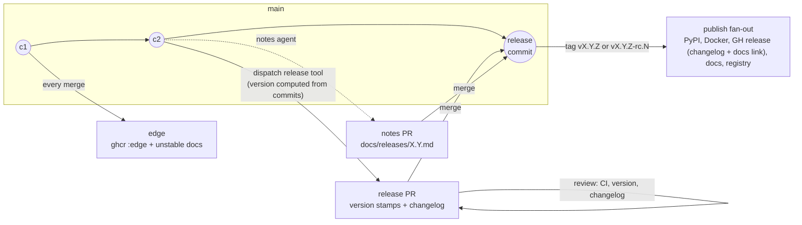

# Release system vision: the release is a pull request

- **Status:** proposal v3, 2026-08-18. v2 revised the vision per maintainer review (conventional commits retained, adopt-not-build, stable equals last rc); v3 folds in a hands-on comparison of knope and release-please against this repo's real manifests, and the maintainer's notes-placement direction (narrative in `docs/releases/`, release body as pointer). Not yet adopted; no machinery changes in this document.
- **Relates to:** epic #1082 (supersedes its design iterations), epic #1054 (closed, superseded), #1055 (cut 4.0.0).
- **Scope:** the intended end-state flow only. How to migrate from the current PSR machinery — sequencing, issue breakdown, the fate of `v4.0.0-rc.1` — is deliberately out of scope and comes after this vision is agreed.

## 1. Why redesign, in one page

Two epics tried to fix releasing and both missed, in opposite directions.

**#1054** shipped a coherent model (trunk releases, `release/X.Y` stabilisation branches, `edge` channel, agent-written notes) on top of PSR — and PSR's identity flaw survived the overhaul: **the version is computed at publish time, after every review has already happened, outside any pull request**. The flaw is not conventional commits — it is *when and where* the computation lands. Everything the audits kept finding traces back to that one fact:

- An rc tag asserts a *prediction* of the stable it stabilises toward, and trunk motion keeps falsifying it — the `v3.2.0-rc.1…7` series ran five weeks and became mathematically unable to ever produce `3.2.0`. Nobody saw the computed version until the tag already existed.
- A stabilisation branch must be *named* `release/X.Y` before the tooling has ever computed `X.Y` — a wrong guess is detected at release time, when it is most expensive.
- Merge-back after every branch release is a hard requirement only because PSR's "already released" check is repo-global while its version computation is ancestry-scoped — a machinery-imposed deadlock, not a property of releasing.
- The release commit is pushed with an admin-bypass token and never passes through CI or review.
- Release notes can only be drafted *after* the stable ships (template#371) — the review happens when it can no longer change anything.

**#1082** correctly diagnosed that the flaw was upstream of implementation, then over-corrected: "owned, verifiable release transactions", per-destination convergence verification, resumable publication, a protected append-only ledger — 18 children, no architecture agreed, zero PRs landed. The lesson taken from it here: move the version computation into a pull request, adopt the tooling that already exists for exactly this, and stop. This use case is not special enough to deserve bespoke machinery.

## 2. Requirements and preferences

**Requirements** — the flow must provide:

1. **`edge` releases on `main`** — every merge builds and ships a rolling, versionless artifact. (Exists today; kept unchanged.)
2. **PR-style releasing** — a release is prepared as a pull request whose diff contains the version bump and the changelog section, reviewed before anything publishes. Merging it is the act of releasing.
3. **Release candidates** — versioned `vX.Y.Z-rc.N` pre-releases with a clean promotion path to the stable.

**Preferences** — strong defaults that bend before the requirements do, and before they force bespoke machinery:

- **Conventional-commit-driven versioning.** The version is computed from commit history, as today. The correction over PSR is placement, not authorship: the computation lands in the reviewed diff, with `Release-As`-style overrides for the exceptional case — override is the escape hatch, never the default.
- **Adopt maintained tooling; do not build.** Owned release machinery is a maintenance liability that two epics have now demonstrated. Where an existing tool covers the flow, the flow bends to the tool.
- **The stable release equals the last rc — same source, asserted.** Promotion re-releases the candidate's exact source tree: the stable's diff against the last rc contains version/changelog stamps and nothing else, and the promotion path verifies this mechanically. (Bit-for-bit identical *artifacts* are out of reach where the version is baked in — a PyPI wheel's metadata carries it — so same-source-asserted is the deliberate strictness level.)
- **The narrative lives in `docs/releases/`, not in the release PR.** The AI-written notes are reviewed in their own PR against the docs page, exactly as the notes contract works today. The GitHub release body is the machine changelog plus a pointer to the versioned docs page. Nothing hand-written needs to survive inside a tool-regenerated release PR — which is what makes mainstream tooling viable (§6).
- **No new per-contributor process.** Feature PRs keep their current discipline (conventional title, linked issue). No changeset-file-per-PR or news-fragment obligations.

## 3. The model

> A release is a pull request. The release tool computes the version from conventional commits and maintains a release PR carrying the bump and changelog; the narrative is reviewed in a sibling docs PR; merging the release PR is the decision, and a follow-up run tags and publishes.

### The three channels, restated

| Channel | Identity | Promise |
|---|---|---|
| `edge` | none — the commit is the identity | newest merged code, rebuilt on every merge to `main`; rolling, disposable |
| rc | `vX.Y.Z-rc.N` — the target was **computed and reviewed in a merged PR** | an installable stabilisation step toward exactly that version |
| stable | `vX.Y.Z` | the promotion of the last rc's exact source, or a direct cut from quiescent trunk; rolling pointers follow it only when it is newest in its series |

The rc promise finally holds: the target is no longer an unreviewed prediction. If the computation lands on a version the maintainer disagrees with, that surfaces in the release PR's diff — before any tag exists — and is corrected there.

## 4. The flow

### 4.1 Prepare

A human dispatches the release tool on the branch to release from (`main` by default). Releasing stays a deliberate event — dispatch-driven, not push-driven, so the release PR appears when a release is wanted, not on every merge. The tool:

1. **Computes the version** from conventional commits since the last release in that branch's series (`!`/`BREAKING CHANGE` → major, `feat` → minor, else patch). On a stabilisation branch the per-branch config yields `X.Y.Z-rc.N` instead (§4.4).
2. **Stamps the version-coupled files** in the release PR's diff: `pyproject.toml`, `CHANGELOG.md`, `uv.lock`'s self-version, and — on the stable path only — `server.json` and the Claude-plugin manifests (rc versions never reach PyPI, so PyPI-pinning manifests keep the last stable — unchanged invariant, now encoded as per-branch tool config rather than script logic).
3. **Renders the changelog section** from the same conventional commits — machine-written, never hand-maintained.
4. **Opens or refreshes the release PR** against the branch it was dispatched from.

In parallel, the **notes agent** drafts or extends `docs/releases/X.Y.md` (existing `writing-release-notes` skill, unchanged evidence contract) as a sibling PR to `main` — now draftable as soon as a release PR exists, rc phase included, which resolves template#371's "notes can only be reviewed after the stable ships". The advisory quiescence check (release milestone, `ships-atomically` label) runs at prepare time — still advisory, never blocking.

### 4.2 Review

The release PR is an ordinary PR. Full CI runs on it — **the released commit has passed CI**, which the PSR-pushed release commit never did. The reviewer checks the computed version against the breaking-change policy (the review is the correction point the current system lacks: a mis-typed `!` no longer silently mis-versions a release) and the changelog section. The notes PR is reviewed on its own clock against the evidence contract; it does not gate the release (unchanged from today's contract), and hand edits are safe there because the release tool never touches it.

If trunk moves while a release PR is open, its content is refreshed by re-dispatching; merging a stale release PR would ship commits the changelog does not describe, so an advisory staleness check comments when the base has advanced.

### 4.3 Merge = release

Merging the release PR is the decision; a follow-up tool run (triggered by the merge) tags the release commit `vX.Y.Z[-rc.N]` and creates the GitHub release. The body is the machine changelog section plus a pointer to the versioned docs notes page — appended by the same body-edit step the pipeline has today. Tag creation is the only remaining ruleset-sensitive operation, replacing today's direct release-commit and merge-back pushes to `main`.

The publish fan-out is unchanged, with every gate derived from the tag's version string (prerelease-ness is `-rc.` in the tag — itself reviewed, so gate and intent cannot desync):

- stable: PyPI (trusted publishing), Docker `vX.Y.Z` + ordering-gated `latest`/`vX`/`vX.Y`, linux packages, mcpb bundle, `mike deploy` + ordering-gated `latest` alias, marketplace and MCP-registry entries (ordering-gated);
- rc: Docker `vX.Y.Z-rc.N`, GH pre-release + mcpb bundle only.

### 4.4 Release candidates and promotion

An rc is a release PR on a branch whose tool config declares the rc channel — `release/X.Y` carries `prerelease: rc` configuration; `main` never runs it. Cut rcs from a stabilisation branch when genuinely stabilising; quiescent-trunk stables need no rc and no branch (unchanged doctrine from design decision 23).

**Promotion honors "the stable is the last rc," same-source-asserted.** Finalizing is one commit on the branch: an empty `chore: release X.Y.Z` carrying a `Release-As: X.Y.Z` footer, then dispatch — the tool builds the stable release PR at exactly that version, from exactly the candidate's source. The publish path verifies mechanically that nothing but release stamps changed since `vX.Y.Z-rc.N` and refuses otherwise — new source means a new rc, never a silently different stable. Notes were already drafted and reviewed during the rc cycle; promotion adds no new prose. No finalize flag, no one-run generated config override.

### 4.5 Stabilisation branches and backports

`release/X.Y` remains the exception tool for the same two cases (dirty trunk at cut time; patching a shipped release, with the branch created retroactively from the tag). Release PRs simply target the branch; the tag lands there. The tool tracks per-branch release state, so the branch's rc tags and `main`'s stable tags cannot cross-contaminate — and the branch-naming chicken-and-egg is defused: the computed version is visible in the release PR before any tag exists, so a misnamed branch is a rename, not a burned tag.

**Merge-back as deadlock prevention is abolished** — with per-branch state there is nothing on `main` that a branch tag can wedge. What `main` still wants from a branch release is bookkeeping: the changelog section, the manifest stamps, and the tool's state file. Those port to `main` as an ordinary automated PR — no admin bypass, no conflict-resolution script, and nothing deadlocks if it merges late.

### 4.6 `edge`

Unchanged, by design: push to `main` → `ghcr :edge` + `mcpb-bundle-edge` artifact + rolling `unstable` docs. No tag, no release, no version, no manifest churn. `edge` stays the sole rolling unstable tag; rcs ship only under immutable version tags.

## 5. Decisions

| # | Decision |
|---|---|
| D1 | A release is a pull request; merging it is the act of releasing. |
| D2 | The version is computed from conventional commits **inside the release PR**, where it is reviewed before any tag exists. `Release-As`-style overrides exist for the exceptional case; they are never the default. The version is never computed at publish time. |
| D3 | Channel (rc vs stable) is a property of the branch's committed tool configuration, expressed in the version string inside the reviewed diff; every publish gate derives from the resulting tag, never from a dispatch-time flag. |
| D4 | The tag is created by the tool *after* merge, on the merged release commit. Direct pushes to protected branches are removed from the release path. |
| D5 | `edge` is untouched: versionless, rolling, one producer. |
| D6 | The AI narrative lives in `docs/releases/`, reviewed in its own PR (existing notes contract), draftable from the moment a release PR exists — rc phase included (resolves template#371). The GitHub release body is the machine changelog plus a pointer to the versioned docs page. The release PR carries no hand-written prose, so tool regeneration can never destroy review work. |
| D7 | `CHANGELOG.md` stays machine-written from conventional commits by the release tool, rendered into the release PR diff. |
| D8 | Conventional commits and the PR-title gate are retained at full weight: they feed both the changelog and the version computation, with the release PR as the review point PSR never had. |
| D9 | The breaking-change policy (operator surface / public library interface, assessed against last stable) is unchanged; `!` markers drive the computed major bump and the release-PR reviewer verifies the result against the policy. |
| D10 | The stable is the promotion of the last rc's exact source — **same source, asserted**: the publish path verifies a stamps-only diff against the candidate and refuses if other commits intervened; new source requires a new rc. |
| D11 | Stabilisation branches remain the exception tool. Merge-back as deadlock prevention is abolished; branch releases port changelog/state/notes bookkeeping to `main` via an ordinary automated PR. |
| D12 | rc release PRs never touch PyPI-pinning manifests (`server.json`, plugin manifests); those move on stable only — encoded as per-branch tool configuration. `uv.lock` moves on every release. |
| D13 | The flow is implemented by adopting **release-please**, with knope as the evaluated fallback (§6). Owned machinery shrinks to the publish fan-out (which exists) and thin guards; `scripts/bump_manifests.py` retires entirely. The flow is tool-agnostic: if the adopted tool disappoints, the adopter is swapped, not the model. |
| D14 | Per-destination convergence verification, publication ledgers, and resumable-transaction machinery are explicitly rejected as over-engineering. Workflow runs, the release-contract tests, and `get_server_info` are the observability surface. |

## 6. Tooling: adopt, don't build

Both finalists were evaluated hands-on against this repo's real files (2026-08-18): knope 0.23.0 exercised end-to-end in a scratch repo; release-please 17.11.1 verified by driving the library's own strategy and updater classes, with source citations for every load-bearing behavior.

**Recommended: [release-please](https://github.com/googleapis/release-please)** (the action, dispatch-only). The mainstream release-PR tool, and every previously assumed blocker checked out as solvable in-tool:

- **Stamping needs zero glue.** All five manifest touch points are expressible as built-in `extra-files` updaters and were verified byte-level on the real files: `server.json`'s top-level version, `packages[].version`, *and* the `:vX.Y.Z` substring inside the oci identifier (the JSON updater rewrites the semver substring within a string value); `plugin.json`; the `==X.Y.Z` pin inside `.mcp.json`'s args; and `uv.lock`'s self-version via the generic TOML updater (surgical single-line edit, formatting preserved). `scripts/bump_manifests.py` retires entirely.
- **The rc→stable trap is routed around, not hit.** The known bug (googleapis/release-please#2515) only bites when switching the versioning strategy to `default` to finalize — a path this flow never enters. Per-branch configs give `release/X.Y` the `prerelease: rc` strategy while `main` keeps stable; finalization is one empty commit with a `Release-As: X.Y.Z` footer, verified to produce exactly `X.Y.Z` after `X.Y.Z-rc.N`, tagged normally and not marked prerelease. That *is* the D10 promotion.
- **Per-branch state natively.** Config and version-manifest are read from the target branch, release matching is per-branch, and release-PR branches are distinct — rc series on a branch and stables on `main` cannot cross-contaminate, which is what retires the merge-back deadlock (D11).
- **Conditional rc stamping falls out of the same mechanism**: the branch config simply omits the PyPI-pinning manifests from `extra-files` (D12), reproducing today's prerelease skip as configuration.
- **Changelog fidelity is the best of the three tools**: linked entries, and `revert:` commits render into a visible "Reverts" section — better than PSR's default and far better than knope (below). The `Revert "..."` shape still fails to parse, same as today; existing guidance transfers.
- **Dispatch-only operation works** (the action is trigger-agnostic; a merged release PR waits under `autorelease: pending` until the next run tags it) — preserving "merging is not releasing" and letting a human decide when a release PR appears at all.

Known friction, accepted with eyes open: the two-phase shape (dispatch → PR; merge → tag run); the `Release-As` finalize-commit ceremony; the first rc in a series is `-rc` unnumbered (seedable with a one-time `Release-As: X.Y.0-rc.1`); a stale release PR can ship un-changelogged commits (advisory check + re-dispatch, §4.2); the release PR branch is force-push-regenerated, so nothing else may ever be pushed onto it (moot — nothing needs to be); a stable finalized *on a branch* needs its finalize commit to also restore the omitted `extra-files` in the branch config; and upstream is responsive to Google's needs, not the community's — plan around the tool as-is, never around upstream fixes.

**Fallback: [knope](https://knope.tech).** Hands-on it covered the core well: identical bump rules and `v*` tags, an rc series with the cleanest promotion of any tool (a plain run after rcs yields exactly the target version — no footer, no config flip), `--override-version`, excellent dry-runs, and a first-class release-PR recipe. It loses the recommendation on evidence, not posture: `versioned_files` hard-enforces same-version lockstep, making the stable-only manifest skip unrepresentable — a stamping script must be *kept* (as a Command step) rather than retired; changelog entries lose PR/commit links and **both revert shapes vanish from the changelog entirely**; rc numbering starts at `rc.0`; and the existing `CHANGELOG.md` needs a one-time heading normalization. Add pre-1.0 single-maintainer status, and it is the fallback: fully workable if release-please ever has to go, at the cost of a kept script and a poorer changelog.

**Retired: PSR.** A release-PR mode is architecturally absent and was declined upstream (python-semantic-release#355); its model — compute, commit, tag, push in one unreviewable shot — is precisely the shape being removed. Building the flow by hand (v1's recommendation) is likewise rejected per the adopt-don't-build preference.

## 7. What the redesign deletes

- PSR itself: config block, action, the deprecated `angular` parser concern (template#370).
- `scripts/bump_manifests.py` and its container constraints — every stamp becomes tool configuration.
- The `CHANGELOG.md` insertion-flag contract and its tests — the tool owns changelog placement; `tests/test_release_contract.py` is rewritten around the new invariants (§8).
- The merge-back machinery: `scripts/merge_back.sh`, its tests, the retry loop — the deadlock it guarded against no longer exists.
- The `finalize` generated-config override and the `force` input (replaced by per-branch config and `Release-As`).
- Admin-bypass direct pushes of release commits and merge-backs to `main`.
- Prediction-asserting rc tags, and the class of defects behind template#154 and #235.
- The post-release-only limitation of the notes pipeline: notes become draftable at rc time. The notes pipeline itself — agent PR against `docs/releases/`, merge-is-publish body/docs refresh — survives in simplified form (D6).

## 8. What survives unchanged

- The release *model* prose: trunk-first, value-triggered cadence, branch-as-exception, quiescence signals (advisory), "merging is not releasing" — only the mechanics under it change. A feature merge feeds `edge`; a release-PR merge releases.
- Conventional commits and the PR-title gate, at full weight (D8).
- Ordering-aware rolling pointers (Docker `latest`/`vX`/`vX.Y`, GH latest-release, docs `latest`, marketplace, registry) — a backport never repoints them backwards.
- The notes evidence contract, the one-page-per-minor format, `RELEASE-SUMMARY` markers, and the machine/narrative boundary between `CHANGELOG.md` and `docs/releases/`.
- The release-contract tests, rewritten to assert the same invariants against the tool's configuration: rc leaves PyPI-pins untouched; stable bumps every published field; committed pins in lockstep at the last stable; promotion diff is stamps-only; the `extra-files` set matches the files the tests enumerate (pinning the updater behavior against tool upgrades).
- Per-branch release concurrency; one tag, one producer; immutable tags.

## 9. Open questions (to settle at design review, not to grow)

1. **Live end-to-end spike** on a scratch GitHub repository with the real action: dispatch-only cadence, the `pull_request: closed` tagging trigger, per-branch configs, the `Release-As` finalize, and the rulesets interaction. The library-level behaviors are verified; the action wiring is not yet. First implementation step, and the go/no-go for the fallback.
2. **rc numbering**: accept release-please's `-rc, -rc.1, -rc.2` series as-is, or seed `-rc.1` with a one-time `Release-As` per series. (Cosmetic; PEP 440 normalizes either way.)
3. **Tag/token mechanics**: which token the tool runs with so the tag push passes the `v*` ruleset and downstream `release: published` workflows still fire. Decide with the rulesets change.
4. **First release under the new system** and the disposition of `v4.0.0-rc.1` / `release/4.0` — a migration question, parked until the vision is agreed.

Implementation is template-first (`fastmcp-server-template` owns `release.yml`, the release-contract tests, and this configuration; an mvm-first build would be clobbered by the next `copier update`), adopted here through a released template version. Sequencing that migration is the next document, not this one.
