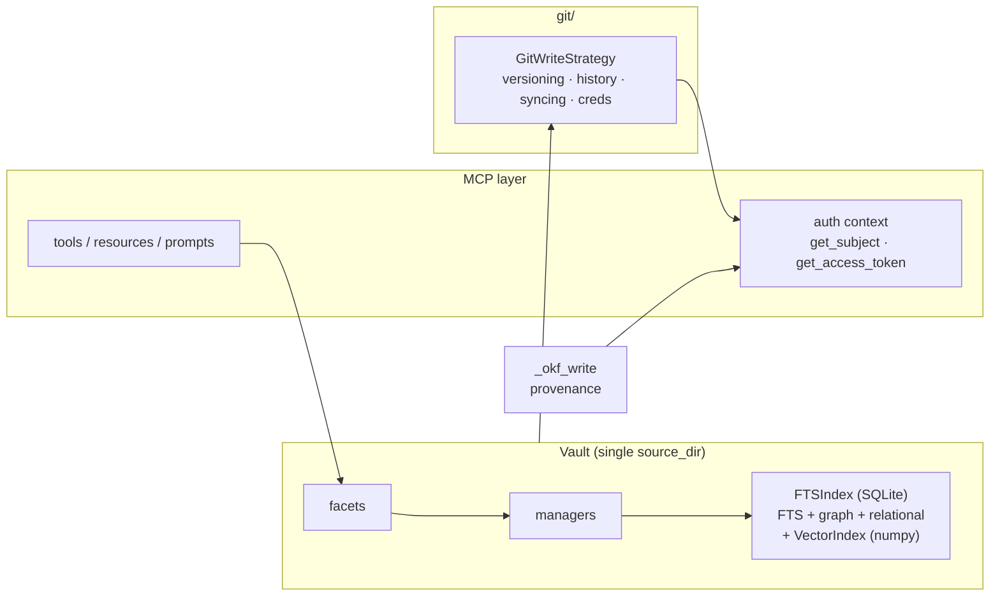
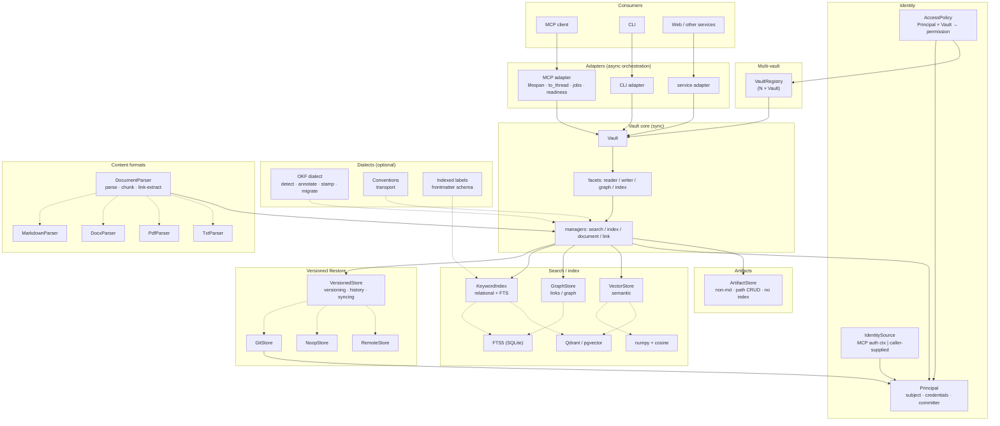

# Decoupling and Layering — Architectural Investigation

> **Status:** investigation (long-term). No implementation proposed.
> **Date:** 2026-08-23
> **Related:** [`vault-service-separation.md`](vault-service-separation.md) — the
> orthogonal *process-separation* study; [`README.md`](README.md) ties the two
> together.

## Purpose

Two framings, one investigation:

- **Maintainability.** The vault's internals have grown a few god classes and a
  few scattered concerns. Decoupling them into single-purpose components behind
  interfaces is the long-term maintainability play.
- **Potential.** Combined with the process-separation study, this maps what the
  project *could* become: not a single MCP server, but a layered vault platform
  with pluggable versioning, identity, and search backends, usable in-process, as
  a service, from a CLI, and from a web frontend.

The question this study answers is **whether these directions are worth
investigating in theory** — not *how* to get there. Sequencing, mechanics, and
migration are deliberately out of scope.

## 1. The current coupling

### 1.1 Identity is scattered and MCP-coupled

"Who is acting" is four aspects, each resolved from a different place, two of
them reaching into the MCP auth context:

| Aspect | Today | Source |
|---|---|---|
| Subject (who) | `_okf_write.resolve_write_actor` | `fastmcp_pvl_core.get_subject` → `human:<subject>` or a tool actor |
| Credentials (tokens) | `GitWriteStrategy._token` / `._username` | config (`GIT_TOKEN`/`GIT_USERNAME`) |
| Committer identity (name/email) | `GitWriteStrategy._check_identity` / `_extract_claim` | config (`GIT_COMMIT_NAME`/`EMAIL`) **or** OIDC claims read from the MCP access token (`fastmcp.server.dependencies.get_access_token`) |
| Permissions (what) | implicit — `read_only` flag, no per-user model | config |

There is no `Principal` object; identity is a set of ad-hoc reads scattered
across the write path, and two of them (`get_subject`, `get_access_token`) bind
the vault's write semantics to the MCP request context.

### 1.2 The git strategy is a god class

`GitWriteStrategy` (`git/strategy.py`, ~1,930 lines) carries at least five
responsibilities, which map cleanly onto three concerns plus credentials:

| Concern | Methods |
|---|---|
| **Versioning** (commit/checkout) | `__call__` (the `on_write` commit), `_stage_and_commit`, `_ensure_write_init`, `_check_identity`, and the conflict-resolution family (`_resolve_rebase_conflicts`, `_abort_in_progress_rebase`, `_restore_upstream_paths`, `_write_conflict_files`) |
| **History** (log/diff) | `get_file_history`, `get_file_diff`, `_resolve_path_at_ref` |
| **Syncing** (pull/push) | `force_pull`, `_pull_pipeline`, `force_push`, `sync_once`, `_pull_loop`, `_schedule_push`, `_do_push`, `_push_if_unpushed`, `_lfs_pull` |
| **Credentials/identity** | `_git_env`, `_redact`, `_extract_claim`, `_check_identity`, `_ensure_managed_repo`, `_check_remote_protocol` |

`Vault` depends on it **concretely** (`git_strategy: GitWriteStrategy | None`),
and `_build_git_strategy` in `config_sections/_assembly.py` always constructs a
`GitWriteStrategy` and wires it as *both* `git_strategy` and `on_write`. There is
no seam to substitute a different versioning backend.

### 1.3 The index/search stack is concrete

Three concrete classes, no backend seam:

- **`FTSIndex`** (`fts_index.py`, ~2,150 lines) — SQLite FTS5, but also the
  relational store (`documents`/`sections`/`tags`/`links`), the graph queries
  (backlinks/outlinks/broken/orphans/most-linked/connection-path), TOC, listing,
  and counting. One class, one backend, many concerns.
- **`VectorIndex`** (`vector_index.py`, ~530 lines) — numpy embeddings + cosine
  similarity, with a sidecar metadata list.
- **`SearchManager`** / **`IndexManager`** — the search pipeline (RRF, ranking,
  grouping, snippets) and the build/reindex/embeddings lifecycle, both depending
  on `FTSIndex` and `VectorIndex` concretely.

The design doc's own risk note — *"If tens of thousands, evaluate Qdrant"* — is
exactly this gap: there is no interface to swap the backend behind.

### 1.4 The async orchestration is tied to FastMCP

The vault core is synchronous (a deliberate, documented decision). The async
layer is ~50 `asyncio.to_thread` calls, all in the MCP layer: the tool handlers
(`_server_tools/*`), resources, MCP Apps, the transfer sink, the webhook, the
`needs_queryable` readiness wait, and `domain.py`'s `Service.start`. The
lifespan, the dual-mode jobs (`register_long_running_tool`), and the readiness
gate are FastMCP concepts. A CLI or a service would need its own orchestration —
there is no reusable "adapter" layer between the sync core and any given driver.

### 1.5 The single-vault assumption

`domain.py` holds one `Service` owning one `Vault`, plus a module-level
`_vault_singleton`. `Vault` takes one `source_dir`. Multi-vault means either N
`Vault` instances or a `Vault` serving N roots — neither exists today.

## 2. The decoupled target

### 2.1 Identity component

A `Principal` value object carrying subject, credentials, and committer
name/email, resolved once by an `IdentitySource` and passed down, instead of each
layer reading the MCP context itself. Permissions are a separate concern
(authorization over a `Principal`, not part of the value object).

- **In-process:** `IdentitySource` reads the MCP auth context (the current
  `get_subject` / `get_access_token` reads, moved behind one interface).
- **Across a service boundary:** the caller supplies the `Principal` (the
  "identity propagation" finding from the first study, made concrete).

The git strategy and the OKF write layer stop reading the MCP context and take a
`Principal` instead. This is also the foundation for multi-user: a `Principal`
is what a permission check is *about*.

### 2.2 Versioned filestore — one interface or three?

The git strategy's five responsibilities collapse into three concerns:
**versioning** (commit/checkout), **history** (log/diff), and **syncing**
(pull/push). The open question is whether these are one interface with three
facets, or three interfaces.

**Interpretation A — one `VersionedStore` with three facets.**

- *Pro:* one dependency, one construction point, one lifecycle for the vault; a
  git-backed vault always needs all three, so a single interface matches the
  current usage; it mirrors the existing `Vault` shape (four facets:
  reader/writer/graph/index); `NoopStore`/`RemoteStore` no-op or delegate the
  facets they don't have; fewer interfaces to maintain, document, and test.
- *Con:* a fat interface with three reasons to change (versioning semantics,
  history query shape, sync protocol); a consumer that only wants history is
  coupled to the versioning/syncing surface it never uses; it risks becoming a
  god interface mirroring the god class it replaced; harder to evolve one concern
  independently without touching the shared interface.

**Interpretation B — three interfaces (`Versioner`, `HistorySource`, `Syncer`).**

- *Pro:* each interface has one reason to change; consumers depend on only what
  they need; consistent with the "distinct concepts" principle (see §2.3 — the
  graph is distinct from search, and by the same logic versioning/history/syncing
  are distinct); independent evolution of each concern.
- *Con:* more interfaces to maintain, document, test, and wire; the vault holds
  three references instead of one; risk of over-abstraction if no consumer ever
  wants one without the others; the three concerns operate on the same repo, so
  splitting can create artificial seams that leak (e.g. `Syncer` needs to know
  about `Versioner`'s commits to push them).

**Resolution: three narrow interfaces, one implementation.** The deciding
evidence is that the consumers already want different subsets — `GitQueryManager`
uses only `get_file_history`/`get_file_diff` (history), the webhook uses only
`force_pull` (syncing), and the write path uses commit + pull/push (versioning +
syncing). The current code already has this split implicitly; the interfaces make
it explicit. A single `GitStore` class implements all three and is passed as one
object, while each consumer depends on the specific interface it needs — interface
segregation without forcing three separate objects.

### 2.3 Search/index abstraction — three distinct concepts

The `FTSIndex`'s many concerns are three distinct concepts, each its own
interface:

- **`KeywordIndex`** — the relational document store + full-text search
  (`search`, `get_note`, `list_*`, `get_toc`, …). `FTS5Index` (SQLite) is the
  current implementation.
- **`GraphStore`** — the link graph (`get_backlinks`, `get_outlinks`,
  `get_broken_links`, `get_orphan_notes`, `get_most_linked`,
  `get_connection_path`, neighborhood/hub views). Distinct from search: the graph
  is about *structure* (what links to what), not *relevance* (what matches a
  query). The current `FTS5Index` implements both over the same SQLite DB; a
  future backend could split them (e.g. a graph store alongside a search index).
- **`VectorStore`** — the semantic surface (`add`, `search`, `search_by_path`,
  `delete_by_path`). `NumpyVectorStore` is the current implementation.

`SearchManager` and `IndexManager` depend on the interfaces, not the classes. The
embedding *provider* is already abstracted (`EmbeddingProvider`); this extends the
same move to the *storage* it feeds.

### 2.4 Async orchestration as an adapter layer

The sync vault core stays sync. The async orchestration becomes a thin, reusable
**adapter** per driver: an MCP adapter (lifespan, `to_thread`, jobs, readiness),
a CLI adapter, a service adapter. Each adapter owns its own concurrency model and
wraps the same sync core. This is what makes the core usable from FastMCP, a CLI,
and a service without any of them leaking into the core.

### 2.5 Multi-vault registry

A `VaultRegistry` owning N `Vault` instances (one per `source_dir`), replacing the
single `Service`/singleton. Consumers resolve a vault by name/path; the registry
owns construction, lifecycle, and the per-vault index/writer.

### 2.6 Multi-user — a modeling question

The architecture should *enable* both per-user vaults and shared vaults with
per-user permissions, without committing to either. That is a modeling decision,
not an implementation one: the model keeps three concepts distinct, and both
deployment patterns fall out of how they are combined.

- **`Vault`** — the data, one per `source_dir`. Deliberately user-agnostic: it
  knows nothing about who is reading or writing.
- **`Principal`** — the identity (who is acting).
- **`AccessPolicy`** — the mapping `Principal × Vault → permission`
  (read/write/none).

Per-user vaults are the case where each `Principal` maps to its own `Vault` with
write permission; shared vaults are the case where many `Principal`s map to the
same `Vault` with different permissions. The `Vault` never changes between the
two — only the `AccessPolicy` does. Whether the implementation ever supports
multi-user is a separate question; the model does not foreclose it.

### 2.7 Dialects and artifacts — optional layers on the core

The core vault is dialect-agnostic by design: the spec's non-goal is that the
server "treats all `.md` files structurally identically" and imposes no
frontmatter convention. But three optional layers add semantics on top, and one
kind of content is a different thing entirely:

- **OKF** — the heaviest dialect: detection (`okf_version` in `index.md`), read
  annotations (`type`/`status`/`stale`/`trust_tier`), write provenance
  (`generated` stamp, `verified` clear), reserved-file maintenance (`log.md`/
  `index.md`), migration tools (`okf_convert_links`/`okf_generate_index`/
  `okf_seed_log`), and bundle export. Today it is woven through the index (OKF
  keys join `indexed_frontmatter_fields`), the read path (annotations), and the
  write path (provenance) — gated by `OKF_MODE`, but not *pluggable*.
- **Conventions** — a lighter dialect: transport of `_conventions.md` text.
  Already the cleanest of the three (pure disk I/O, zero index coupling).
- **Indexed labels** — a configurable schema: which frontmatter fields are
  promoted to `document_tags`. Baked into the index and the chunking provenance.

- **Artifacts** — non-md files (attachments): binary, no frontmatter, not
  indexed, path-based CRUD. A different kind of content from markdown documents,
  currently overloaded onto the document tools via extension dispatch.

The decoupling: the core vault stays dialect-agnostic, and the dialects become
**pluggable extensions** that hook into the core at well-defined points — detect,
annotate-read, stamp-write, promote-fields, maintain-reserved-files. The core
invokes the hooks; the dialects implement them. Artifacts become a separate
`ArtifactStore` with its own interface, not overloaded onto the document tools.

### 2.8 Content format — the core is format-agnostic

The concepts — documents, index, search, graph, versioning, identity — are
format-agnostic, but the implementation is markdown-specific at every layer: YAML
frontmatter parsing, heading-based chunking (H1–H6), markdown/wikilink link
extraction, and the `.md` extension baked into document identity. A docx, pdf,
txt, or tex file is still a document that can be indexed, searched, linked, and
versioned — but the markdown parser makes no sense for it.

The abstraction: a **`DocumentParser`** (or `ContentFormat`) interface that takes
a file and produces the normalized `ParsedNote` — the document model the core
already operates on (`path`, `title`, `chunks`, `links`, `metadata`, hash). The
core is format-agnostic because it consumes `ParsedNote`s, not markdown. The
markdown parser is the current implementation; docx/pdf/txt/tex parsers are
future ones.

The `ParsedNote`/`Chunk` model is already close to format-agnostic; the
markdown-specific residue is `heading`/`heading_level` (H1–H6) and `frontmatter`
(YAML). Generalizing these to a "section" concept and a "metadata" dict is the
only change the model needs. `ChunkStrategy` is already a partial abstraction
(chunking); `DocumentParser` extends it to parsing + link extraction + metadata.

The dialects (§2.7) are also markdown-specific in their current form — they read
frontmatter, which is a markdown convention. A format-agnostic core would need
the dialects to read the normalized `metadata` instead, so the two abstractions
compose: `DocumentParser` normalizes the format, the dialect hooks interpret the
normalized document.

### 2.9 The indexable boundary

§2.7 and §2.8 collapse to a single seam. A file is either:

- **Indexable** — it goes through `DocumentParser` (format) and the dialect hooks
  (interpretation) to become a document in the model: searched, graphed,
  versioned, interpreted.
- **Artifact** — everything else: path CRUD only, no index, no dialect.

The current code already draws this boundary (`.md` vs. non-md), but hard-codes
"indexable" to "markdown." The abstraction generalizes "indexable" to "format +
dialect": any format a `DocumentParser` can parse, and any dialect that can
interpret the result, is indexable. Everything else is an artifact.

## 3. The decoupled component diagram

### Current (coupled)

### Target (decoupled)

Nine seams, each an interface or extension point the core depends on instead of
a concrete class or a global context: **`VersionedStore`**,
**`Principal`/`IdentitySource`**, **`KeywordIndex`/`GraphStore`/`VectorStore`**,
the **adapter layer**, **`AccessPolicy`**, **`VaultRegistry`**, the **dialect
hooks** (OKF/conventions/indexed-labels as pluggable extensions),
**`ArtifactStore`** (non-md content as a separate store), and **`DocumentParser`**
(the content format, so the core consumes `ParsedNote`s, not markdown).

## 4. The combined potential

The two studies are orthogonal and compose. The first (process separation) asks
*where* the vault runs; this one asks *how its internals are shaped*. Together
they describe one target:

| Axis | First study (process) | This study (internal) |
|---|---|---|
| Deployment | vault as a separate service; MCP as a thin client | — |
| Versioning | git moves into the service | `VersionedStore` with `GitStore`/`NoopStore`/`RemoteStore` |
| Identity | identity propagation across the boundary | `Principal`/`IdentitySource`/`AccessPolicy` |
| Search | the service owns the index | `KeywordIndex`/`GraphStore`/`VectorStore` with swappable backends |
| Content model | — | dialect hooks (OKF/conventions/indexed-labels) + `ArtifactStore` |
| Content format | — | `DocumentParser` (markdown/docx/pdf/txt/tex → `ParsedNote`) |
| Scale | one service, many consumers | `VaultRegistry` (multi-vault) + multi-user |

The end-state is a **vault platform**: a sync core with pluggable versioning,
identity, and search, driven by interchangeable adapters (MCP, CLI, service),
running in-process or as a service, over one or many vaults, for one or many
users. The current single MCP server is the *integrated* corner of that space —
the first study's "separated lives next to integrated" and this study's
"decoupled lives next to concrete" are the same principle at two scales.

## 5. What is already abstracted (patterns to follow)

The codebase already applies this pattern in four places, which is the strongest
argument that the git strategy, identity, and index are the *exceptions*, not the
rule:

| Abstraction | Where | Shape |
|---|---|---|
| `EmbeddingProvider` | `providers.py` | ABC + implementations (Ollama/OpenAI/FastEmbed) |
| `Summarizer` | `summarizer.py` | ABC + OpenAI-compatible backend |
| `ChunkStrategy` | `scanner.py` | `Protocol` + `HeadingChunker`/`WholeDocumentChunker` |
| `TransferSink` | pvl-core | `Protocol` + `VaultTransferSink` |

`VersionedStore`, `Principal`, and `KeywordIndex`/`GraphStore`/`VectorStore` are
the same move applied to the three places that have not yet received it.

## 6. Worth investigating

All six seams are worth investigating in theory; the question this study answers
is *whether*, not *how*. For completeness, the relative weight if the work is
ever picked up (not a plan, not a sequence):

- **`VersionedStore`** — highest leverage: it is the largest god class, the
  consumers already want different subsets, and it unblocks the `RemoteStore` the
  first study's separated mode needs.
- **`Principal`/`IdentitySource`** — small but touches write-path semantics
  (provenance, committer identity); prerequisite for multi-user.
- **`KeywordIndex`/`GraphStore`/`VectorStore`** — the largest behavioural surface
  (every query flows through it), but the interfaces are already implied by the
  manager boundaries; the Qdrant risk note is the forcing function.
- **Dialect hooks + `ArtifactStore`** — the dialects (OKF especially) are the most
  woven-in of the optional layers; extracting them into pluggable extensions is
  the clearest "optional aspect" win, and `ArtifactStore` removes the
  extension-dispatch overload on the document tools.
- **`DocumentParser`** — the format abstraction. The `ParsedNote` model is already
  close to format-agnostic, so this is mostly generalizing `heading`/`frontmatter`
  and moving the markdown-specific parse/chunk/link code behind an interface. The
  lowest *immediate* value (no non-markdown consumer exists), but the highest
  *conceptual* leverage — it is what makes "vault" mean "documents" rather than
  "markdown files."
- **Adapter layer** — the sync core is already there; extracting the async
  orchestration is mostly mechanical.
- **`AccessPolicy`** and **`VaultRegistry`** — the largest behavioural change
  (lifecycle, per-vault index/writer, consumer resolution), and the most
  product-shaped.

**Risks:** the `VersionedStore` split is a large refactor of a bug-magnet file
(`git/strategy.py` — 23 bug fixes in its history); the `Principal` change alters
provenance semantics (a behavioural change, not just structure); the
`KeywordIndex`/`GraphStore`/`VectorStore` split touches every query path; and
multi-vault/multi-user is a *product* decision the code can only enable, not
settle.

## 7. Open questions

Resolved in this revision: the graph is a distinct concept (`GraphStore`, §2.3);
multi-user is modeled to enable both per-user and shared vaults (§2.6); and
`VersionedStore` is three narrow interfaces with one implementation (§2.2).

Still open:

- **Does `KeywordIndex` need a separate relational `DocumentStore`?** The
  relational store (`documents`/`sections`/`tags`) currently rides inside
  `FTSIndex` alongside FTS and graph. Whether it is its own interface is a finer
  decomposition than this study needs to settle.
- **Does the `AccessPolicy` live in the vault core or in the adapter?** The model
  keeps it distinct; where it is *enforced* (core vs. adapter) is an
  implementation question this study deliberately leaves open.
